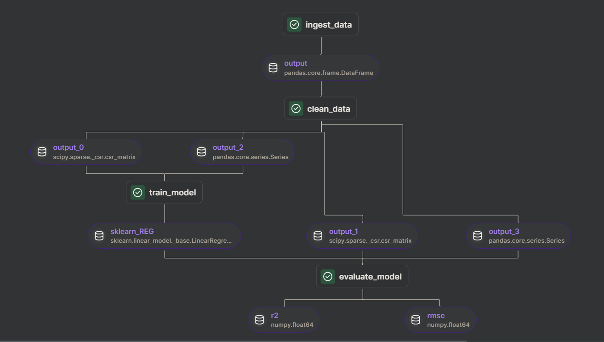
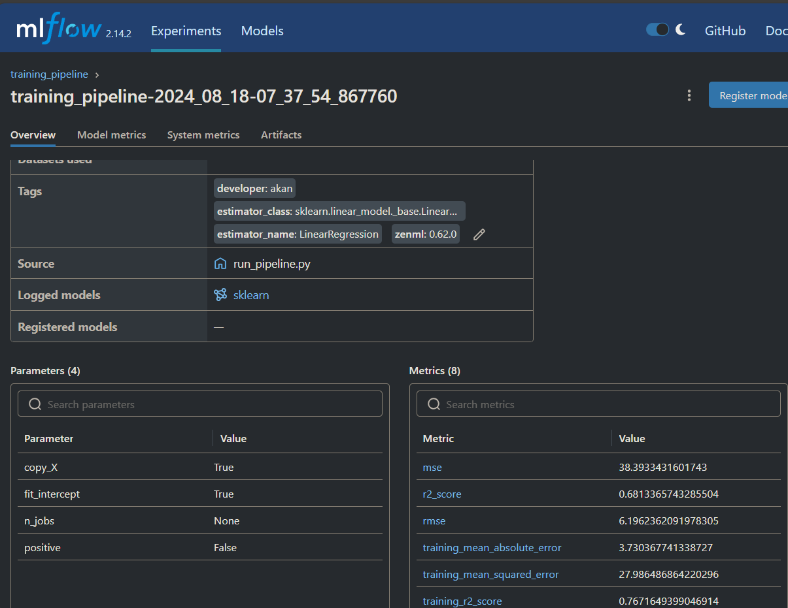

## Title: Taxi Ride Duration Prediction

#### Project Overview
The objective of this project is to develop a predictive model that estimates the duration of taxi rides in urban areas. By leveraging data such as traffic conditions, weather, time of day, and ride distance, the model aims to provide accurate predictions that can enhance operational efficiency for taxi services. The model will be trained on historical taxi ride data, which includes timestamps, geolocation coordinates, and ride durations. This project seeks to optimize taxi fleet management and improve customer satisfaction by reducing wait times and providing reliable estimates for ride durations.

#### Problem Statement
Urban transportation is a complex system influenced by various dynamic factors that can significantly affect the duration of taxi rides. These factors include traffic congestion, road closures, weather conditions, and the time of day. Accurately predicting taxi ride durations is a challenge that has direct implications for the efficiency of taxi operations and the satisfaction of passengers. The goal of this project is to construct a machine learning model capable of forecasting the time a taxi ride will take, given the starting point, destination, and other relevant variables. Such a model can assist taxi companies in dispatching their fleets more effectively and offering better service to their customers.


### Get Started: Predicting NYC Taxi Rides Duration

This is my submission for the MLOPs 2024 cohort for DataTalks.

This work/workflow shows steps through __ingesting__, cleaning,training and promoting a model through a data/machine learning
lifecycle using (zenml)[] orchestration tool.

How to use this:

```chatinput
git clone https://github.com/AkanimohOD19A/submission_MLOPs24-cohort.git .

cd .
```
SetUp your virtual environment name
```
python3 -m venv <env_name>
<env_name>/Scripts/activate
```
This will clone this repository and create a new virtual environment "<env_name>"

Now, install all the requirements with:
```
pip install zenml["server"]
pip install -r requirements.txt

## install mlflow
zenml integration install mlflow -y
```

Next, we have to set up a stack that would serve to manage our processes:

The project can only be executed with a ZenML stack that has an MLflow experiment tracker and model deployer as a component. Configuring a new stack with the two components are as follows:
```
zenml experiment-tracker register mlflow_tracker --flavor=mlflow
zenml model-deployer register mlflow --flavor=mlflow
zenml stack register local-mlflow-stack -a default -o default -d mlflow -e mlflow_tracker --set
```

You should see the registered stack when you run:
`zenml stack describe`

Training Pipeline
Our standard training pipeline consists of several steps:

##### Workflow
1. **ingest_data**: This step will ingest the data and create a DataFrame.
2. **clean_data**: This step will clean the data and remove the unwanted columns.
3. **train_model**: This step will train the model and save the model using MLflow autologging.
4. **evaluation**: This step will evaluate the model and save the metrics -- using MLflow autologging -- into the artifact store.
~~5. **model_promoter**: This step compares the newly trained model against the previous production model, in case it performed better, the new model is promoted~~



You should have zenml after this. 
Now run the __run_pipeline__ script with the stated parameters for the period in review:
- taxi-type: "-t" #yellow or green
- year: "-y" #year
- month: "-m" #month

E.g `python run_pipeline.py -t yellow -y 2023 -m 07`

For time management, a sample is taken and a simple Linear Regression is trained on this.

Now `zenml up`, if you are on windows `zenml up --blocking` - this will launch a UI to review your steps/pipeline,
like in the image above.

The script would run the training pipeline and store the results/artifacts from training, it also returns the mlflow artifact
directory to review the *r2*, *mse* and *rmse* trained values.



At the moment, I'm struggling with promoting the model, so CI/CD may suffer at this stage, however this is a remarkable
application of orchestration with regards ML Lifecycle and automation.
